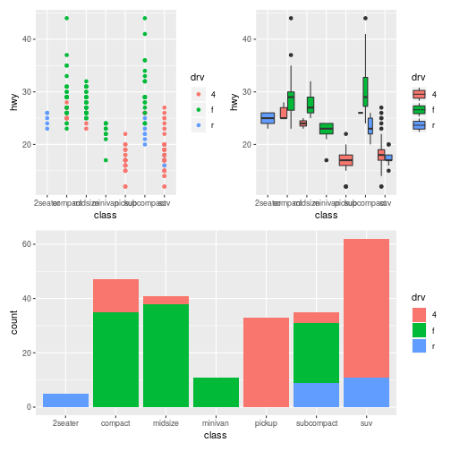
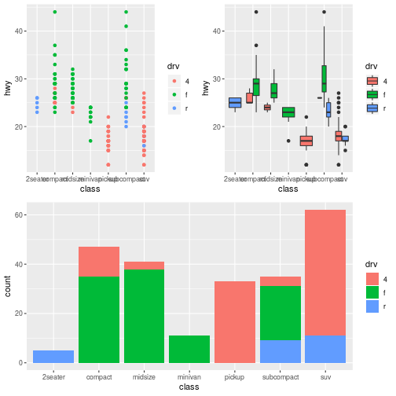
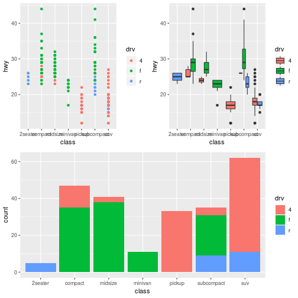

# How to combine multiple ggplots?


```r
library(ggplot2)
p1 <- ggplot(mpg) + geom_point(aes(x = class, y = hwy, color = drv))
p2 <- ggplot(mpg) + geom_boxplot(aes(x = class, y = hwy, fill = drv))
p3 <- ggplot(mpg) + geom_bar(aes(class, fill = drv))
```

## [patchwork](https://patchwork.data-imaginist.com/)

```r
library(patchwork)
(p1 + p2) / p3
```



## [cowplot](https://cran.r-project.org/web/packages/cowplot/vignettes/introduction.html)

```r
library(cowplot)
plot_grid(plot_grid(p1, p2, ncol = 2), p3, ncol = 1)
```



## [gridExtra](https://cran.r-project.org/web/packages/gridExtra/vignettes/arrangeGrob.html)

```r
library(gridExtra)
grid.arrange(arrangeGrob(p1, p2, ncol = 2), p3, ncol=1)
```


