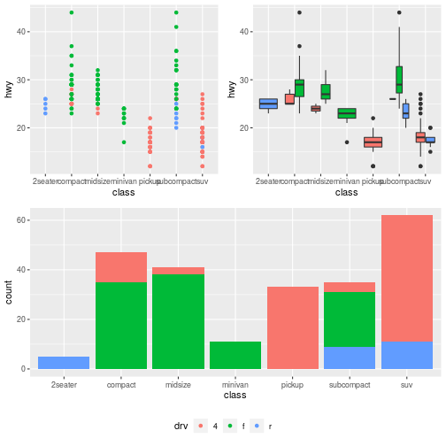

# How to fix the figure paths generated by Rmarkdown?

By default, the `knitr::knit` function will generate plots in the
current "figure" directory and set relative path "figure/plot.png" to
the markdown file. For example:

```markdown

```

However, the `vuepress build` ignores the figure folder. 

Here is how to fix it:

First, to set option "base.url" by `opts_knit`, then compile the Rmarkdown file. 
```r
library(knitr)
opts_knit$set(base.url = "/")
knit("blog.Rmd")
```
The plot path will be "/figure/plot.png".

Second, copy the "figure" folder to ".vuepress/dist" after the pages built.
```bash
vuepress build takehomessage --temp takehomessage/.temp
rsync -av takehomessage/_posts/figure takehomessage/.vuepress/dist/
```

The figures should be good to display.

Ref: <http://www.randigriffin.com/2017/04/25/how-to-knit-for-mysite.html>
